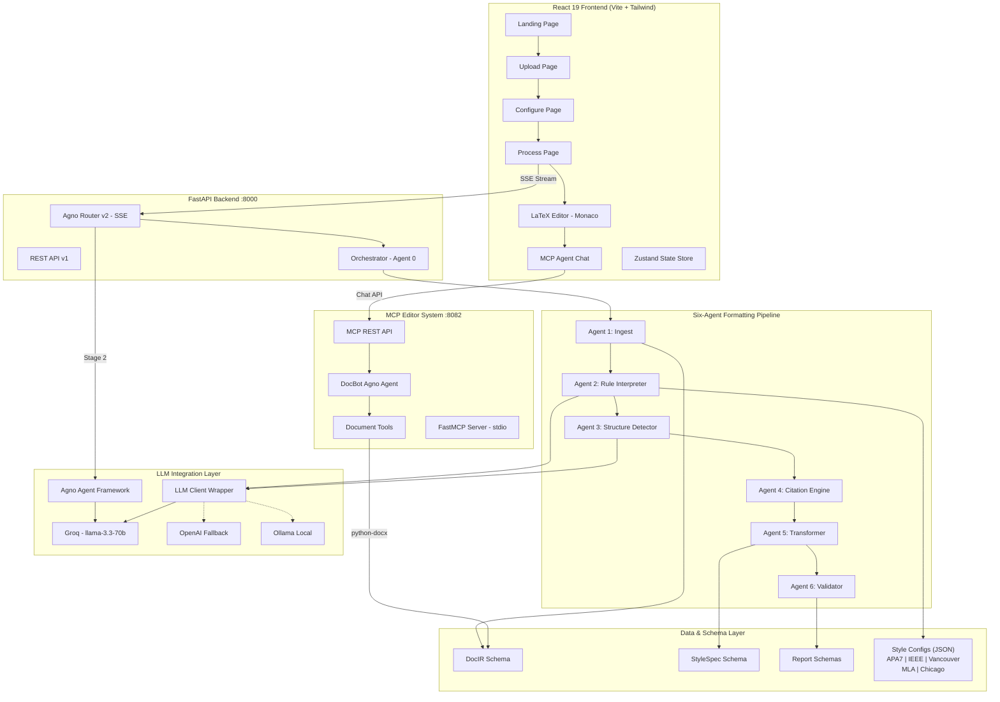
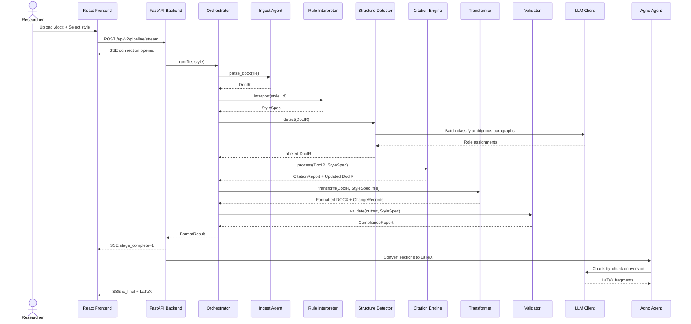
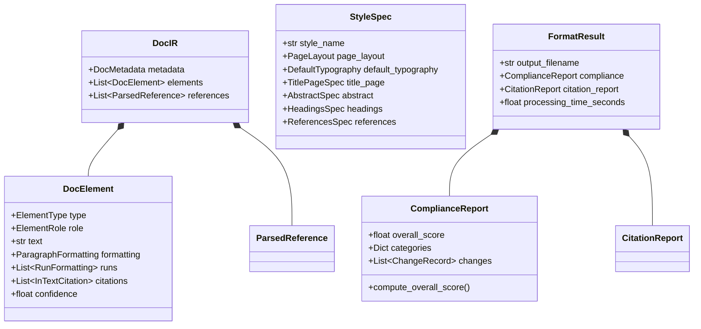
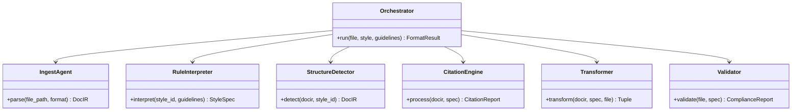
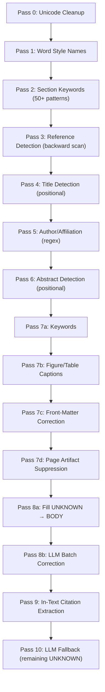
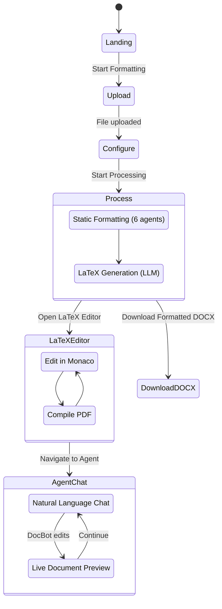

# FormatForge AI — Comprehensive Technical Documentation

**Project Codename:** Docling  
**Event:** HackaMineD 2026 (Cactus Communications / Paperpal)  
**Version:** 1.0  
**Date:** June 2025  

---

## Table of Contents

1. [Executive Summary](#1-executive-summary)
2. [System Architecture Overview](#2-system-architecture-overview)
3. [Technology Stack](#3-technology-stack)
4. [Project Directory Structure](#4-project-directory-structure)
5. [Core Data Schemas](#5-core-data-schemas)
6. [The Six-Agent Formatting Pipeline](#6-the-six-agent-formatting-pipeline)
   - 6.1 [Agent 0 — Orchestrator](#61-agent-0--orchestrator)
   - 6.2 [Agent 1 — Ingest Agent](#62-agent-1--ingest-agent)
   - 6.3 [Agent 2 — Rule Interpreter](#63-agent-2--rule-interpreter)
   - 6.4 [Agent 3 — Structure Detector](#64-agent-3--structure-detector)
   - 6.5 [Agent 4 — Citation Engine](#65-agent-4--citation-engine)
   - 6.6 [Agent 5 — Transformer](#66-agent-5--transformer)
   - 6.7 [Agent 6 — Validator](#67-agent-6--validator)
   - 6.8 [Paragraph Merger (Utility)](#68-paragraph-merger-utility)
7. [LLM Integration Layer](#7-llm-integration-layer)
8. [LLM-Based LaTeX Generation (Stage 2)](#8-llm-based-latex-generation-stage-2)
9. [Five Supported Academic Styles](#9-five-supported-academic-styles)
10. [MCP Document Editor Agent](#10-mcp-document-editor-agent)
11. [Frontend Application](#11-frontend-application)
12. [API Reference](#12-api-reference)
13. [Diagrams](#13-diagrams)
    - 13.1 [System Architecture Diagram](#131-system-architecture-diagram)
    - 13.2 [Pipeline Sequence Diagram](#132-pipeline-sequence-diagram)
    - 13.3 [Data Schema Class Diagram](#133-data-schema-class-diagram)
    - 13.4 [Agent Class Hierarchy](#134-agent-class-hierarchy)
    - 13.5 [Structure Detector 10-Pass Flowchart](#135-structure-detector-10-pass-flowchart)
    - 13.6 [User Journey State Diagram](#136-user-journey-state-diagram)
14. [Configuration and Environment](#14-configuration-and-environment)
15. [Testing](#15-testing)

---

## 1. Executive Summary

FormatForge AI is an end-to-end academic manuscript formatting system that automates the tedious and error-prone process of converting research papers into publication-ready documents conforming to specific academic citation and formatting standards. The system accepts DOCX manuscripts, automatically detects their internal structure (titles, authors, abstracts, headings, references, citations), applies pixel-perfect formatting rules for the chosen academic style, and optionally generates a complete LaTeX source for typesetting.

The platform operates through a two-stage processing pipeline:

- **Stage 1 (Static Formatting):** A deterministic six-agent pipeline parses the document into an intermediate representation, classifies every paragraph by its structural role, loads the target style specification, reformats the DOCX output using python-docx, processes citations and references, and validates compliance against the target style. Agents 4 (Citation Engine), 5 (Transformer), and 6 (Validator) operate with zero LLM calls, relying entirely on regex pattern matching and rule-based logic.

- **Stage 2 (LaTeX Generation):** The Agno agent framework, powered by the Groq-hosted `llama-3.3-70b-versatile` model, converts the formatted manuscript into a complete LaTeX source file. The manuscript is split into logical sections, each section is independently converted by the LLM, and the results are merged with a style-specific LaTeX preamble and post-processed to fix common generation artifacts.

An additional **MCP (Model Context Protocol) Document Editor Agent** provides post-pipeline interactive editing capabilities. Users can chat in natural language with "DocBot," which edits the formatted DOCX in real time using 25+ registered document manipulation tools.

---

## 2. System Architecture Overview

The system comprises four major subsystems that communicate through well-defined interfaces:

### 2.1 FastAPI Backend (Port 8000)

The central server hosts two API versions:
- **v1 REST API** (`backend/api.py`): Synchronous endpoints for formatting, parsing, style enumeration, and file downloads.
- **v2 Agno Router** (`backend/agno_router.py`): Server-Sent Events (SSE) streaming endpoint that combines Stage 1 static formatting with Stage 2 LLM-based LaTeX generation. The frontend connects to `POST /api/v2/pipeline/stream` and receives real-time progress events.

### 2.2 Six-Agent Pipeline

Located in `backend/agents/`, this is the core formatting engine. The Orchestrator instantiates and sequences six specialized agents, each with a single responsibility. The pipeline operates on a shared `DocIR` (Document Intermediate Representation) that accumulates structural annotations as it passes through each agent.

### 2.3 MCP Editor System (Port 8082)

An independent FastAPI service (`mcp_editor/api.py`) that wraps an Agno-powered conversational agent ("DocBot") with 25+ DOCX manipulation tools. This provides a chat interface for post-formatting fine-tuning. A standalone FastMCP server (`mcp_editor/mcp_server/server.py`) also exposes the same tools over the stdio transport for MCP-compatible clients.

### 2.4 React Frontend

A single-page application built with React 19, Vite, and Tailwind CSS. It provides a five-step guided workflow: Upload → Configure → Process → LaTeX → Agent. State is managed centrally through a Zustand store.

---

## 3. Technology Stack

### Backend
| Component | Technology |
|-----------|-----------|
| Web framework | FastAPI (Python 3.11+) |
| Document processing | python-docx (DOCX read/write) |
| Citation formatting | citeproc-py with CSL 1.0 styles |
| Data validation | Pydantic v2 (BaseModel schemas) |
| LLM orchestration | Agno framework |
| LLM providers | Groq (llama-3.3-70b-versatile), OpenAI, Ollama |
| Fuzzy string matching | thefuzz (Levenshtein distance) |
| SSE streaming | sse-starlette |
| Legacy frontend | Streamlit (`app.py`) |

### Frontend
| Component | Technology |
|-----------|-----------|
| Framework | React 19 |
| Build tool | Vite |
| Styling | Tailwind CSS |
| State management | Zustand |
| Code editor | Monaco Editor (@monaco-editor/react) |
| Routing | react-router-dom v7 |
| Animations | Framer Motion, GSAP, Three.js |
| Rich text | TipTap (@tiptap/react) |
| File upload | react-dropzone |
| Math rendering | KaTeX, MathJax |

### MCP System
| Component | Technology |
|-----------|-----------|
| Agent framework | Agno (with SqliteDb persistence) |
| MCP protocol | FastMCP (Model Context Protocol) |
| Transport | stdio (MCP standard) |
| LLM | Groq (llama-3.3-70b-versatile) |

---

## 4. Project Directory Structure

```
MinedHackathon/
├── app.py                          # Streamlit legacy frontend (286 lines)
├── requirements.txt                # Python dependencies
├── start_all.bat                   # Launch script for all services
├── run.bat                         # Single-service launcher
├── teammate_api_mcp.py             # Standalone unified MCP + REST API (1509 lines)
│
├── backend/                        # Core formatting pipeline
│   ├── __init__.py
│   ├── api.py                      # FastAPI v1 REST endpoints (~170 lines)
│   ├── agno_router.py              # v2 SSE streaming + LaTeX generation (605 lines)
│   ├── config.py                   # Environment config and path constants (~55 lines)
│   ├── agents/                     # Six-agent pipeline
│   │   ├── orchestrator.py         # Agent 0: Pipeline controller (~130 lines)
│   │   ├── ingest.py               # Agent 1: DOCX → DocIR parser (329 lines)
│   │   ├── rule_interpreter.py     # Agent 2: Style specification loader (359 lines)
│   │   ├── structure_detector.py   # Agent 3: 10-pass structure detection (1119 lines)
│   │   ├── citation_engine.py      # Agent 4: Citation processing (797 lines)
│   │   ├── transformer.py          # Agent 5: DOCX formatting (1382 lines)
│   │   ├── validator.py            # Agent 6: Compliance scoring (626 lines)
│   │   └── paragraph_merger.py     # PDF fragmentation merger (447 lines)
│   ├── llm/                        # LLM client abstraction
│   │   ├── client.py               # Unified LLM client (203 lines)
│   │   └── prompts.py              # All prompt templates (~180 lines)
│   ├── schemas/                    # Pydantic data models
│   │   ├── docir.py                # Document IR schema (269 lines)
│   │   ├── reports.py              # Report schemas (~200 lines)
│   │   └── style_spec.py           # Style specification schema (~300 lines)
│   ├── styles/                     # Hardcoded style JSON configurations
│   │   ├── apa7.json               # APA 7th Edition
│   │   ├── ieee.json               # IEEE
│   │   ├── vancouver.json          # Vancouver
│   │   ├── mla.json                # MLA
│   │   └── chicago.json            # Chicago
│   └── utils/                      # Utility modules
│       ├── citation_parser.py
│       ├── reference_parser.py
│       └── text_utils.py
│
├── mcp_editor/                     # MCP Document Editor Agent
│   ├── api.py                      # Unified REST API + Agent (1581 lines)
│   ├── doc_editor_agent/
│   │   ├── agent.py                # Agno Agent definition (~170 lines)
│   │   └── doc_tools.py            # DOCX manipulation tools (526 lines)
│   └── mcp_server/
│       └── server.py               # FastMCP standalone server (546 lines)
│
├── frontend/                       # React SPA
│   ├── package.json                # Dependencies and scripts
│   ├── vite.config.js              # Vite configuration
│   ├── index.html                  # Entry HTML
│   └── src/
│       ├── App.jsx                 # Route definitions
│       ├── main.jsx                # React entry point
│       ├── LatexCompiler.jsx       # Standalone LaTeX compiler component (149 lines)
│       ├── pages/
│       │   ├── Landing.jsx         # Hero landing page (154 lines)
│       │   ├── Upload.jsx          # File upload with drag-and-drop
│       │   ├── Configure.jsx       # Style and engine selection
│       │   ├── Process.jsx         # Real-time pipeline monitoring
│       │   ├── Latex.jsx           # Monaco-based LaTeX editor (530 lines)
│       │   └── McpAgent.jsx        # Chat interface for DocBot (396 lines)
│       ├── components/             # Reusable UI components
│       │   ├── Badge.jsx, Button.jsx, Card.jsx
│       │   ├── ComplianceGauge.jsx, Navbar.jsx, Progress.jsx
│       │   ├── RichTextEditor.jsx, Sidebar.jsx, SplitEditors.jsx
│       │   ├── StepProgress.jsx, SuggestionPanel.jsx
│       │   ├── Tabs.jsx, Toasts.jsx, Tooltip.jsx
│       │   └── ValidationReport.jsx
│       └── store/
│           └── useAppStore.js      # Zustand global state
│
├── documents/                      # Uploaded document storage
├── output/                         # Pipeline output directory
│   ├── formatted/                  # Formatted DOCX files
│   └── reports/                    # JSON compliance reports
│
├── rule_based_standalone/          # Standalone rule-based API variant
│   ├── api1.py
│   ├── index.html
│   └── agents/, schemas/, styles/
│
└── tests/                          # Test suite
    ├── test_phase0.py .. test_phase4.py
    └── test_mla_chicago.py
```

---

## 5. Core Data Schemas

The system defines three families of Pydantic v2 models that form the data backbone of the entire pipeline.

### 5.1 Document Intermediate Representation (DocIR)

**File:** `backend/schemas/docir.py` (269 lines)

The `DocIR` is the universal internal format that all agents read and write. Every document, regardless of its source format, is converted into a `DocIR` by the Ingest Agent.

**Key Types:**

- **`ElementType`** (enum): `paragraph`, `table`, `image`, `page_break`, `section_break`
- **`ElementRole`** (enum): 20 structural roles including `title`, `author_info`, `abstract_label`, `abstract_body`, `keywords`, `heading_1` through `heading_5`, `body`, `reference_label`, `reference_entry`, `table_caption`, `figure_caption`, `page_artifact`, `unknown`
- **`RunFormatting`**: Per-run character-level formatting (font name, size, bold, italic, underline, color, superscript, subscript, highlight, strikethrough)
- **`ParagraphFormatting`**: Paragraph-level formatting (alignment, line spacing, space before/after, first-line indent, left indent, hanging indent)
- **`InTextCitation`**: Detected in-text citation with start/end offsets, style (numeric/author_date/narrative), and matched reference key
- **`AuthorName`**: Structured author with family, given, and suffix fields
- **`ParsedReference`**: Fully parsed reference entry with authors, year, title, source, volume, issue, pages, DOI, URL, publisher, and a `to_csl_json()` method for citeproc-py compatibility
- **`TableCell`**: Cell text, row/column span, and formatting
- **`TableData`**: Grid of `TableCell` objects representing a complete table
- **`DocElement`**: The fundamental unit — wraps text, type, role, formatting, runs, citations, table data, confidence score, and image description
- **`DocIR`**: Top-level container holding metadata and an ordered list of `DocElement` instances plus parsed references

### 5.2 Style Specification (StyleSpec)

**File:** `backend/schemas/style_spec.py` (~300 lines)

The `StyleSpec` captures every formatting rule needed to transform a document. Each of the five supported styles has a corresponding JSON file that deserializes into this schema.

**Key Types:**

- **`PageLayout`**: Page dimensions, all four margins, column count, column spacing
- **`DefaultTypography`**: Font name, font size, line spacing, first-line indent, paragraph alignment
- **`TitlePageSpec`**: Whether a separate title page is required, title font size, title case transformation, title bold/alignment, author placement
- **`AbstractSpec`**: Label text, max word count, label formatting (bold, alignment), body indent, body font size
- **`HeadingLevelSpec`**: Per-level (1-5) heading format — font size, bold, italic, alignment, case transformation, numbering style (ieee/apa/none), prefix text
- **`HeadingsSpec`**: Container for all five heading levels with a `get_level(n)` accessor
- **`RunningHeadSpec`**: Running header enablement, max characters, font size
- **`ReferencesSpec`**: Section label, hanging indent, entry spacing, label formatting, DOI display preferences
- **`TablesSpec`**: Caption position (above/below), number label, caption formatting
- **`FiguresSpec`**: Caption position, number label, number bold/italic, title italic
- **`InTextCitationSpec`**: Citation style (numeric/author_date), bracket format (square/parentheses), multiple citation delimiter, author-date et al. threshold, ampersand or "and" preference

### 5.3 Report Schemas

**File:** `backend/schemas/reports.py` (~200 lines)

- **`ChangeRecord`**: Documents a single formatting change (category, description, old/new values, rule reference, status [applied/skipped/failed], severity)
- **`CategoryScore`**: Score (0-100), weight, lists of issues and passes per validation category
- **`ComplianceReport`**: Overall weighted score, per-category scores, changes, warnings, errors; contains `compute_overall_score()` method
- **`CitationMatch`**: Links an in-text citation to its reference entry
- **`OrphanReference`**: A reference entry with no corresponding in-text citation
- **`CitationFormatIssue`**: A detected formatting problem (e.g., "& instead of and")
- **`CitationReport`**: Aggregated citation analysis with matched, orphan, and format issue lists; `compute_score()` method
- **`FormatResult`**: Final pipeline output encapsulating output filename, compliance report, citation report, structure summary, and total processing time

---

## 6. The Six-Agent Formatting Pipeline

The core formatting engine is a linear pipeline of six specialized agents coordinated by an Orchestrator. Each agent performs a focused task and communicates through the shared `DocIR` and `StyleSpec` structures.

### 6.1 Agent 0 — Orchestrator

**File:** `backend/agents/orchestrator.py` (~130 lines)

The Orchestrator is the central controller that instantiates all six agents and executes them in sequence. It manages the overall pipeline flow:

1. **Ingest** → Produces the initial `DocIR` from the uploaded DOCX
2. **Rule Interpreter** → Loads or generates the `StyleSpec`
3. **Structure Detector** → Labels every element with its structural role
4. **Citation Engine** → Processes citations and references, produces a `CitationReport`
5. **Transformer** → Applies formatting rules, produces the output DOCX and `ChangeRecord` list
6. **Validator** → Reads the output DOCX and scores compliance

The Orchestrator returns a `FormatResult` containing all outputs for the API to deliver.

### 6.2 Agent 1 — Ingest Agent

**File:** `backend/agents/ingest.py` (329 lines)

The Ingest Agent converts an uploaded DOCX file into the `DocIR` intermediate representation. This agent handles the complexities of the Open XML format:

**Parsing Strategy:**
- Walks the DOCX XML body sequentially (not `doc.paragraphs`), processing `w:p` (paragraph) and `w:tbl` (table) elements in their true document order. This preserves the interleaved ordering of paragraphs and tables that python-docx's flat `.paragraphs` list does not maintain.

**Paragraph Processing (`_parse_paragraph`):**
- Extracts every run with its character-level formatting: font name, font size, bold, italic, underline, color, superscript, subscript, highlight, strikethrough
- Resolves inherited fonts by traversing the style chain: run-level font → paragraph style font → document default font
- Detects inline images by scanning for `w:drawing` elements and marks elements of type `image`
- Extracts paragraph-level formatting: alignment, line spacing, space before/after, first-line indent, left indent

**Table Processing (`_parse_table`):**
- Iterates every row and cell, extracting text and cell-level formatting
- Produces a `TableData` object with the full cell grid

**Limitations:**
- PDF and TXT parsers are declared but not implemented (raise `NotImplementedError`); PDF support is partially addressed through the Paragraph Merger utility

### 6.3 Agent 2 — Rule Interpreter

**File:** `backend/agents/rule_interpreter.py` (359 lines)

The Rule Interpreter loads formatting rules for the target academic style. It supports three input pathways with a clear priority cascade:

1. **Custom guidelines text** → LLM interprets free-form text into a `StyleSpec`
2. **Custom guidelines URL** → Fetches the URL content, then applies LLM interpretation
3. **Hardcoded JSON** → Loads the pre-authored JSON specification from `backend/styles/`

**Hardcoded Style Loading:**
For the five supported styles (APA7, IEEE, Vancouver, MLA, Chicago), the agent reads the corresponding JSON file and deserializes it into a Pydantic `StyleSpec` object. This path involves zero LLM calls and provides deterministic, validated output.

**LLM-Based Interpretation:**
When custom guidelines are provided, the agent:
1. Chunks long guideline text into segments of 6,000 characters each (up to 24,000 total)
2. Sends each chunk through the LLM client with the `RULE_INTERPRETER_SYSTEM` and `RULE_INTERPRETER_USER` prompts
3. Performs a refinement pass where partial results are merged
4. Deep-merges the extracted fields with a default StyleSpec to fill gaps
5. Validates through Pydantic with field-level error recovery (invalid fields fall back to defaults)

### 6.4 Agent 3 — Structure Detector

**File:** `backend/agents/structure_detector.py` (1,119 lines)

The Structure Detector is the most complex agent in the pipeline. It assigns a structural role (`ElementRole`) to every element in the `DocIR` through a sophisticated 10-pass heuristic engine augmented by LLM correction for ambiguous elements.

#### Pass-by-Pass Breakdown:

| Pass | Name | Technique | Description |
|------|------|-----------|-------------|
| 0 | Unicode Cleanup | Static | Removes invisible characters (BOM, zero-width spaces, soft hyphens) |
| 1 | Word Style Names | Static | Maps built-in Word style names (Heading 1, Title) to ElementRole values |
| 2 | Section Keywords | Regex | Matches paragraph text against 50+ known section headings (Introduction, Methods, Results, Discussion, Conclusion, Literature Review, Background, Related Work, etc.) organized in a `SECTION_KEYWORDS` dictionary |
| 3 | Reference Detection | Regex | Backward-scans from document end to find reference sections; detects numbered references `[1]`, `[2]`... and alphabetical author entries |
| 4 | Title Detection | Heuristic | Identifies the document title by finding the first non-author paragraph in positions 0-5 of the document |
| 5 | Author/Affiliation | Regex | Recognizes author and affiliation lines using patterns for university names, email addresses, ORCID identifiers, department mentions, and date patterns |
| 6 | Abstract Detection | Positional | Locates the abstract as text between front-matter (title/authors) and the first section heading |
| 7a | Keywords Detection | Regex | Identifies keyword lists containing pipe-separated or comma-separated terms |
| 7b | Caption Detection | Regex | Matches "Figure N:" and "Table N:" caption patterns |
| 7c | Front-Matter Correction | Positional | Extends author_info classifications to catch missed fragments in the front-matter zone |
| 7d | Page Artifact Suppression | Regex | Suppresses page headers, footers, DOIs, journal footnotes, and copyright notices by classifying them as `page_artifact` |
| 8a | Fill Body | Static | Assigns `BODY` role to all remaining `UNKNOWN` elements |
| 8b | LLM Batch Correction | LLM | Sends batches of 40 front-matter elements and 30 low-confidence paragraphs to the LLM for role reclassification. The LLM receives element text and index and returns corrected role assignments in JSON format |
| 9 | In-Text Citations | Regex | Extracts three citation styles using compiled regular expressions: `NUMERIC_CITATION_RE` for `[1,2,3]` style, `AUTHOR_DATE_PAREN_RE` for `(Smith, 2020)` style, and `AUTHOR_DATE_NARR_RE` for `Smith (2020)` narrative style. Records start/end offsets for each citation |
| 10 | LLM Fallback | LLM | Processes up to 20 remaining UNKNOWN elements via the LLM for individual classification |

This hybrid approach ensures that the vast majority of elements (typically 90%+) are classified through fast, deterministic heuristics, and only genuinely ambiguous cases fall through to the more expensive LLM calls.

### 6.5 Agent 4 — Citation Engine

**File:** `backend/agents/citation_engine.py` (797 lines)

The Citation Engine is a **completely deterministic** agent — it makes zero LLM calls. All processing is performed through regular expressions, the citeproc-py library, and fuzzy string matching.

**Processing Pipeline:**

**Step 1 — Extract In-Text Citations:**
Re-scans elements using the same regex patterns from the Structure Detector to build a comprehensive list of in-text citations with their positions and styles.

**Step 2 — Parse Reference Entries:**
Iterates through all elements with role `reference_entry` and parses each into a `ParsedReference` object. The parser handles multi-paragraph references by detecting continuation lines (lines that start with lowercase, lack a reference number, or indent differently). Four regex patterns are tried in order:
1. `APA_JOURNAL_RE` — Author(s) (Year). Title. *Journal*, volume(issue), pages. DOI
2. `NUMBERED_JOURNAL_RE` — [N] Author(s), "Title," Journal, vol., no., pp., DOI
3. `BOOK_RE` — Author(s). Title. Publisher, Year.
4. Fallback — assigns the entire text as the title

**Step 3 — Format with citeproc-py:**
Converts parsed references into CSL-JSON format using each reference's `to_csl_json()` method, loads the appropriate CSL style file, registers in-text citations, and generates the properly formatted bibliography. This ensures reference formatting exactly matches the target style's expectations.

**Step 4 — Validate Numeric Citations:**
For numeric styles (IEEE, Vancouver), matches each `[N]` in-text citation with its corresponding reference entry by index number.

**Step 5 — Validate Author-Date Citations:**
For author-date styles (APA, MLA, Chicago), performs fuzzy matching between cited author surnames and the reference list using the Levenshtein distance algorithm (via `thefuzz`). A match threshold (typically 80%) determines successful linkage.

**Step 6 — Detect Format Issues:**
Identifies common formatting problems such as:
- Use of `&` instead of "and" (or vice versa) depending on the style
- Incorrect et al. threshold usage
- Orphan citations (cited but no matching reference)
- Orphan references (listed but never cited)

### 6.6 Agent 5 — Transformer

**File:** `backend/agents/transformer.py` (1,382 lines)

The Transformer is the largest agent and the one that actually modifies the DOCX file. It is **completely deterministic** — zero LLM calls. All formatting is applied through python-docx and direct Open XML manipulation.

**Execution Pipeline:**

1. **Fragmentation Detection and Merging** (Step 0): Uses the `ParagraphMerger` to detect and fix PDF-to-DOCX conversion artifacts where single paragraphs were split into multiple short fragments.

2. **Open and Map** (Steps 1-3): Opens the DOCX file, builds a bidirectional mapping between document paragraphs and `DocElement` entries.

3. **Global Settings** (Step 4): Applies page-wide formatting:
   - Page dimensions (width, height)
   - All four margins
   - Normal style defaults (font name, font size, line spacing)

4. **Per-Role Formatting** (Step 5): Iterates every paragraph and applies role-specific formatting:
   - **Title**: Font size, bold, alignment (center), case transformation (uppercase/title case), zero indent
   - **Author Info**: Font size, center alignment, no indent
   - **Abstract Label**: Bold/plain, center alignment, specific font
   - **Abstract Body**: Indent rules per style, specific font size, line spacing
   - **Keywords**: Italic label prefix, zero indent
   - **Headings (Levels 1-5)**: Each level has its own font size, bold/italic, alignment, case transformation, and numbering scheme. A `_HeadingCounter` class tracks IEEE-style multi-level numbering (Roman → Alpha → Arabic → etc.)
   - **Body**: Standard paragraph formatting with first-line indent, line spacing, alignment
   - **Reference Label**: Bold, center alignment
   - **Reference Entry**: Hanging indent, specific entry spacing
   - **Table Captions**: Number label bold/plain, title italic
   - **Figure Captions**: Number label bold/italic, title italic
   - **Page Artifacts**: Suppressed (text cleared or paragraph removed)

5. **Structural Inserts** (Step 6): Inserts missing labels:
   - "Abstract" label if the abstract has no explicit label paragraph
   - "References" label if the reference section has no header
   - Page breaks between title page and abstract (when the style requires a separate title page)
   - Page break before the reference section

6. **Running Head and Page Numbers** (Step 7): Adds a header to every section containing:
   - Running head text (left-aligned, uppercase, character-limited) — only if the style enables it
   - Page number field (right-aligned) — always inserted
   - Uses a right-tab stop calculated from page width minus margins

7. **Multi-Column Layout** (Step 7.5): For IEEE-style two-column layouts:
   - Inserts a continuous section break after the last front-matter paragraph
   - Sets the first section to single-column (title, abstract, keywords)
   - Sets the final section to N-column layout with equal column widths and specified gap

### 6.7 Agent 6 — Validator

**File:** `backend/agents/validator.py` (626 lines)

The Validator opens the actual output DOCX file and independently measures compliance against the `StyleSpec`. It produces a weighted score across eight categories.

**Scoring Categories and Weights:**

| Category | Weight | What Is Checked |
|----------|--------|-----------------|
| `page_layout` | 15% | Margins (all four), page dimensions |
| `typography` | 15% | Font name, font size, line spacing across body paragraphs |
| `headings` | 15% | Heading formatting (bold, italic, alignment, case) per level |
| `title_page` | 10% | Title presence, title font size, title alignment, title bold |
| `abstract` | 10% | Abstract label presence, abstract indent, abstract font size |
| `citations` | 15% | Citation consistency score from the Citation Engine report |
| `references` | 15% | Reference section label, hanging indent, entry spacing |
| `tables_figures` | 5% | Table/figure caption presence and formatting |

Each category produces a `CategoryScore` with a 0-100 score, a list of detected issues, and a list of passing checks. The overall score is computed as a weighted average: $\text{overall} = \sum_{c} w_c \cdot s_c$ where $w_c$ is the category weight and $s_c$ is the category score.

### 6.8 Paragraph Merger (Utility)

**File:** `backend/agents/paragraph_merger.py` (447 lines)

The Paragraph Merger handles a common problem when documents are converted from PDF to DOCX: paragraphs get split into multiple short fragments. This utility detects and reconstructs the original paragraph boundaries.

**Detection Heuristics:**
- A document is considered fragmented if more than 60% of its paragraphs are shorter than 100 characters AND the median paragraph length is less than 80 characters.

**Merge Logic:**
- Groups consecutive elements of the same mergeable role (e.g., consecutive `BODY` paragraphs)
- Determines continuation using sentence-level heuristics:
  - Previous paragraph does not end with a sentence-terminal character (`.`, `!`, `?`)
  - Current paragraph starts with a lowercase letter
  - Hyphenated word reconstruction across line breaks
  - Short-line boundary detection using the median line length

**Two-Phase Operation:**
1. `build_merge_plan()` → Returns a list of index groups (each group = paragraphs to merge)
2. `apply_merge_plan()` → Produces a new `DocIR` with merged elements

---

## 7. LLM Integration Layer

**File:** `backend/llm/client.py` (203 lines)

The `LLMClient` class provides a unified abstraction over multiple LLM providers with automatic fallback:

**Provider Chain:** OpenAI → Groq → Ollama (local)

**Features:**
- Singleton pattern via `get_llm_client()` to reuse connections
- `chat()` method for free-form text generation
- `chat_json()` convenience method that sets JSON response format and parses the output
- Configurable temperature, max tokens, and system prompts
- Graceful fallback: if the primary provider fails, the client tries the next one

**Prompt Templates** (`backend/llm/prompts.py`):
- `RULE_INTERPRETER_SYSTEM` / `RULE_INTERPRETER_USER`: For extracting StyleSpec from custom guidelines
- `RULE_INTERPRETER_REFINEMENT_USER`: For iterative StyleSpec refinement
- `STRUCTURE_CLASSIFY_SYSTEM` / `STRUCTURE_CLASSIFY_USER`: For batch paragraph role classification
- `REFERENCE_PARSE_SYSTEM` / `REFERENCE_PARSE_USER`: For reference entry parsing
- `EXPLANATION_SYSTEM` / `EXPLANATION_USER`: For generating human-readable explanations of changes

**Usage Pattern:**
The LLM is used sparingly and only where deterministic rules cannot achieve reliable results:
- Structure Detector Pass 8b and Pass 10 (ambiguous paragraph classification)
- Rule Interpreter (custom guidelines interpretation)
- LaTeX generation (Stage 2, via Agno framework)

---

## 8. LLM-Based LaTeX Generation (Stage 2)

**File:** `backend/agno_router.py` (605 lines)

After Stage 1 completes the static DOCX formatting, Stage 2 converts the manuscript into a complete LaTeX source file using the Agno agent framework.

### 8.1 Section Splitting

The `_split_into_sections()` function divides the manuscript text into logical chunks:
- Splits on `\n\n` (double newline) boundaries
- Each chunk is capped at approximately 5,000 characters
- Section headings are kept together with their content
- This chunking ensures that no single LLM call needs to process an excessively long context

### 8.2 Agno Agent Configuration

An Agno `Agent` is instantiated with:
- **Model:** Groq `llama-3.3-70b-versatile` (or a user-selected model like LLaMA-4-Maverick or Qwen-3)
- **System Prompt:** Instructs the model to convert academic manuscript text to well-structured LaTeX, producing only the body content (no preamble, no `\begin{document}`)
- **Temperature:** 0.2 (low randomness for consistent output)

### 8.3 Chunk-by-Chunk Conversion

Each section chunk is sent to the Agno agent with context about which section it represents. The LLM generates LaTeX markup for that section. Progress events are streamed to the frontend via SSE after each chunk completes.

### 8.4 LaTeX Artifact Cleaning

The `_clean_chunk_latex()` function removes common LLM artifacts from each chunk:
- Strips markdown code fences (` ```latex ... ``` `)
- Removes stray `\documentclass`, `\begin{document}`, `\end{document}` tags
- Removes duplicate `\usepackage` directives that belong in the preamble

### 8.5 Style-Specific Preamble Generation

The `_build_preamble()` function generates a complete LaTeX preamble tailored to the target style:

| Style | Document Class | Key Packages | Notable Settings |
|-------|---------------|--------------|------------------|
| **IEEE** | `IEEEtran` | `cite`, `amsmath`, `graphicx`, `url` | Single-column abstract, two-column body, `\IEEEkeywords` |
| **APA 7** | `article` | `apacite`, `natbib`, `geometry`, `setspace` | 1" margins, `\doublespacing`, Times New Roman, running head |
| **Vancouver** | `article` | `geometry`, `setspace`, `natbib` (numbers, square) | 1" margins, double spacing, numbered citations |
| **MLA** | `article` | `geometry`, `setspace`, `fontspec` | 1" margins, double spacing, Works Cited header |
| **Chicago** | `article` | `geometry`, `setspace`, `natbib` (authoryear) | 1" margins, double spacing, Bibliography header |

### 8.6 Post-Processing

The `_postprocess_latex()` function applies final corrections:
- Fixes empty abstract environments (`\begin{abstract}\end{abstract}` → removed)
- Removes markdown artifacts that survived LLM generation
- Removes duplicate `\title{}` commands
- Fixes IEEE-specific keyword formatting (`\begin{IEEEkeywords}`)
- Ensures proper document structure

### 8.7 Frontend LaTeX Sanitization

The frontend's `Latex.jsx` component (530 lines) includes an additional `sanitizeLatex()` function that:
- Deduplicates `\documentclass` declarations
- Resolves conflicting packages (e.g., `natbib` vs `biblatex`)
- For IEEE: removes `geometry`, `setspace`, `natbib`, `indentfirst`, `times`, `subcaption` (handled by IEEEtran)
- Hoists misplaced `\usepackage` commands from body to preamble
- Removes duplicate package imports
- Cleans excessive blank lines

---

## 9. Five Supported Academic Styles

Each style is defined as a comprehensive JSON file in `backend/styles/`. Below is a comparative summary:

### 9.1 Comparative Feature Matrix

| Feature | APA 7th | IEEE | Vancouver | MLA | Chicago |
|---------|---------|------|-----------|-----|---------|
| **Margins** | 1" all | 0.75" top, 0.62" LR, 1" bottom | 1" all | 1" all | 1" all |
| **Font** | Times New Roman 12pt | Times New Roman 10pt | Times New Roman 12pt | Times New Roman 12pt | Times New Roman 12pt |
| **Line Spacing** | 2.0 (double) | 1.0 (single) | 2.0 (double) | 2.0 (double) | 2.0 (double) |
| **Columns** | 1 | 2 (body) | 1 | 1 | 1 |
| **Title Page** | Required (separate) | Not required | Not required | Not required | Required (separate) |
| **Heading Numbering** | None (APA levels) | IEEE Roman/Alpha | None | None | None |
| **Citation Style** | Author-date, parentheses | Numeric, square brackets | Numeric, square brackets | Author-date, parentheses | Author-date, parentheses |
| **Et al. Threshold** | 3+ authors | 3+ authors | 3+ authors | 3+ authors | 4+ authors |
| **Reference Label** | "References" (bold, center) | "References" (bold, center) | "References" (bold, left) | "Works Cited" (center) | "Bibliography" (center) |
| **Hanging Indent** | 0.5" | 0.25" | 0.5" | 0.5" | 0.5" |
| **Running Head** | Enabled (50 chars) | Disabled | Disabled | Disabled | Disabled |
| **Abstract Max Words** | 250 | 200 | 300 | 0 (none) | 300 |

### 9.2 Style JSON Structure

Each JSON file maps directly to the `StyleSpec` Pydantic model. Example fields from `ieee.json`:

```json
{
  "style_name": "IEEE",
  "page_layout": {
    "page_width_inches": 8.5,
    "page_height_inches": 11.0,
    "margin_top_inches": 0.75,
    "margin_bottom_inches": 1.0,
    "margin_left_inches": 0.625,
    "margin_right_inches": 0.625,
    "columns": 2,
    "column_spacing_inches": 0.25
  },
  "default_typography": {
    "font_name": "Times New Roman",
    "font_size_pt": 10,
    "line_spacing": 1.0,
    "first_line_indent_inches": 0.25,
    "paragraph_alignment": "justify"
  },
  "headings": {
    "level_1": {
      "font_size_pt": 10,
      "bold": true,
      "italic": false,
      "alignment": "center",
      "text_case": "upper",
      "numbering": "ieee"
    }
  }
}
```

---

## 10. MCP Document Editor Agent

The MCP (Model Context Protocol) subsystem provides post-pipeline interactive document editing through a conversational AI agent.

### 10.1 Architecture

The MCP editor consists of three layers:

1. **REST API** (`mcp_editor/api.py`, 1,581 lines): A FastAPI server running on port 8082 that exposes chat, document management, and preview endpoints.

2. **Agno Agent** (`mcp_editor/doc_editor_agent/agent.py`): Named "DocBot," this agent is configured with:
   - Groq `llama-3.3-70b-versatile` as the language model
   - SqliteDb for session persistence across conversation turns
   - 5 history runs for conversation context
   - Comprehensive instructions for document manipulation

3. **Document Tools** (`mcp_editor/doc_editor_agent/doc_tools.py`, 526 lines): 25+ pure Python tool functions for DOCX manipulation:

   | Category | Tools |
   |----------|-------|
   | **Reading** | `list_documents`, `get_document_info`, `read_document`, `read_paragraph`, `read_table`, `search_text`, `export_to_text` |
   | **Editing** | `edit_paragraph_text`, `search_and_replace`, `delete_paragraph` |
   | **Adding** | `add_paragraph`, `insert_paragraph_after`, `add_heading`, `add_page_break`, `add_table`, `add_bullet_list`, `add_numbered_list` |
   | **Formatting** | `format_text`, `format_paragraph`, `set_paragraph_style`, `set_paragraph_alignment` |
   | **Management** | `create_document`, `delete_document`, `duplicate_document` |

4. **FastMCP Server** (`mcp_editor/mcp_server/server.py`, 546 lines): Exposes the same tool functions as MCP-compatible tools over the stdio transport, enabling integration with MCP-compatible clients beyond the web interface.

### 10.2 User Interaction Flow

1. After the formatting pipeline completes, the user navigates to the "Agent" tab.
2. The frontend auto-sends a context message identifying the formatted file.
3. DocBot confirms file access and summarizes the document structure.
4. The user sends natural-language instructions (e.g., "Change the title to uppercase," "Add a new section after the conclusion").
5. DocBot invokes the appropriate tools, modifies the DOCX, and reports what was changed.
6. The frontend refreshes the live HTML preview of the document after each interaction.

---

## 11. Frontend Application

### 11.1 Route Structure

| Route | Component | Description |
|-------|-----------|-------------|
| `/` | `Landing` | Hero page with "Start Formatting Free" call-to-action |
| `/upload` | `Upload` | Drag-and-drop DOCX upload area |
| `/configure` | `Configure` | Style selection (5 styles) + LLM engine selection + processing toggles |
| `/process` | `Process` | Real-time pipeline monitoring with SSE log terminal and progress bar |
| `/latex` | `Latex` | Monaco-based LaTeX editor + PDF compiler + asset management |
| `/agent` | `McpAgent` | 3-panel layout: Documents list, live HTML preview, chat interface |

### 11.2 State Management (Zustand)

The `useAppStore.js` Zustand store centralizes all pipeline state:

- `uploadedFile` / `setUploadedFile` / `removeFile`: Uploaded manuscript file
- `currentStep` / `setStep`: Pipeline step (1-5)
- `targetStyle` / `setTargetStyle`: Selected academic style (default: `'ieee'`)
- `llmEngine` / `setLlmEngine`: Selected LLM model
- `formattedFile` / `setFormattedFile`: Output DOCX filename
- `complianceScore` / `setComplianceScore`: Validation score from Agent 6
- `originalContent` / `convertedContent`: Document text before/after formatting
- `latexContent` / `setLatexContent`: Generated LaTeX source
- `processLogs` / `addProcessLog` / `clearProcessLogs`: Real-time pipeline logs
- `mcpSessionId` / `setMcpSessionId`: MCP chat session ID for DocBot

### 11.3 Key Frontend Features

**Process Page (`Process.jsx`):**
- Connects to the SSE endpoint at `/api/v2/pipeline/stream`
- Parses chunked SSE events to extract logs, stage indicators, compliance score, formatted filename, and final LaTeX content
- Displays a terminal-style log output with animated cursor
- Two-segment progress bar showing Stage 1 (0-60%) and Stage 2 (60-100%)

**LaTeX Editor (`Latex.jsx`, 530 lines):**
- Full Monaco Editor with LaTeX syntax highlighting
- Section outline sidebar parsed from LaTeX `\section{}` commands
- Asset management panel for uploading images referenced in LaTeX
- PDF compilation via latexonline.cc — form POST submits the LaTeX source and displays the compiled PDF in an iframe
- `sanitizeLatex()` pre-processor that fixes common LLM generation issues before compilation
- Keyboard shortcut: Ctrl+Enter to compile

**MCP Agent Page (`McpAgent.jsx`, 396 lines):**
- Three-column layout: document list (left), live HTML preview (center), chat (right)
- Auto-sends context message with the formatted file name on first load
- Health check indicator showing MCP server status
- Document preview fetched from `/documents/{filename}/preview` endpoint
- Auto-refreshes preview after each chat interaction

---

## 12. API Reference

### 12.1 Backend API v1 (Port 8000)

| Method | Endpoint | Description |
|--------|----------|-------------|
| GET | `/health` | Health check |
| GET | `/api/v1/styles` | List available styles |
| POST | `/api/v1/format` | Full formatting pipeline (synchronous) |
| POST | `/api/v1/parse` | Structure detection only |
| GET | `/api/v1/download/{filename}` | Download formatted DOCX |

### 12.2 Backend API v2 — Agno Router (Port 8000)

| Method | Endpoint | Description |
|--------|----------|-------------|
| POST | `/api/v2/pipeline/stream` | SSE streaming pipeline (Stage 1 + Stage 2) |
| GET | `/api/v2/download/{filename}` | Download formatted DOCX |

**SSE Event Payloads:**
```json
{"stage": 1, "log": "Parsing document..."}
{"stage": 1, "stage_complete": 1, "compliance_score": 87.5}
{"stage": 2, "log": "Converting section 3/7..."}
{"is_final": true, "latex": "\\documentclass{...}...", "formatted_file": "output.docx"}
{"error": "Pipeline failed: ..."}
```

### 12.3 MCP Editor API (Port 8082)

| Method | Endpoint | Description |
|--------|----------|-------------|
| GET | `/health` | Health check with agent status |
| POST | `/chat` | Send message to DocBot agent |
| GET | `/documents` | List all documents |
| POST | `/documents/upload` | Upload a new document |
| GET | `/documents/{filename}/preview` | Get HTML preview |
| GET | `/documents/{filename}/download` | Download document |
| DELETE | `/documents/{filename}` | Delete document |

---

## 13. Diagrams

### 13.1 System Architecture Diagram



### 13.2 Pipeline Sequence Diagram



### 13.3 Data Schema Class Diagram



### 13.4 Agent Class Hierarchy



### 13.5 Structure Detector 10-Pass Flowchart



### 13.6 User Journey State Diagram



---

## 14. Configuration and Environment

### 14.1 Environment Variables

The application loads configuration from a `.env` file at the project root:

| Variable | Purpose | Default |
|----------|---------|---------|
| `GROQ_API_KEY` | API key for Groq LLM provider | Required |
| `OPENAI_API_KEY` | API key for OpenAI (fallback) | Optional |
| `OLLAMA_BASE_URL` | Base URL for local Ollama instance | `http://localhost:11434` |

### 14.2 Path Configuration (`backend/config.py`)

| Constant | Value |
|----------|-------|
| `PROJECT_ROOT` | Repository root directory |
| `STYLES_DIR` | `backend/styles/` |
| `OUTPUT_FORMATTED_DIR` | `output/formatted/` |
| `OUTPUT_REPORTS_DIR` | `output/reports/` |
| `DOCUMENTS_DIR` | `documents/` |
| `AVAILABLE_STYLES` | `{"apa7", "ieee", "vancouver", "mla", "chicago"}` |

### 14.3 Service Ports

| Service | Port | Launcher |
|---------|------|----------|
| FastAPI Backend | 8000 | `uvicorn backend.api:app` |
| MCP Editor Agent | 8082 | `uvicorn mcp_editor.api:app` |
| React Dev Server | 5173 | `npm run dev` (Vite) |

### 14.4 Startup

The `start_all.bat` script launches all three services. The `run.bat` script launches the backend only.

---

## 15. Testing

**Directory:** `tests/`

The test suite is organized by development phase:

| Test File | Coverage Area |
|-----------|--------------|
| `test_phase0.py` / `test_phase0_full.py` | Ingest Agent — DocIR construction from sample DOCX files |
| `test_phase1.py` | Rule Interpreter — StyleSpec loading for all 5 styles |
| `test_phase2.py` | Structure Detector — Role assignment accuracy |
| `test_phase3.py` | Citation Engine — Reference parsing, matching, format validation |
| `test_phase4.py` | Transformer + Validator — End-to-end formatting and compliance scoring |
| `test_mla_chicago.py` | Targeted tests for MLA and Chicago style implementations |

---

*This documentation was generated through a comprehensive line-by-line analysis of the FormatForge AI codebase. All descriptions, architectural observations, and technical details are derived directly from reading the source code and are original technical documentation of the system's design and implementation.*
