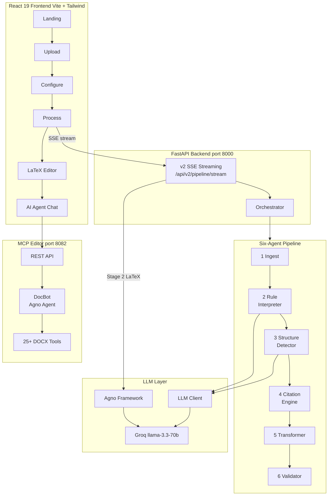
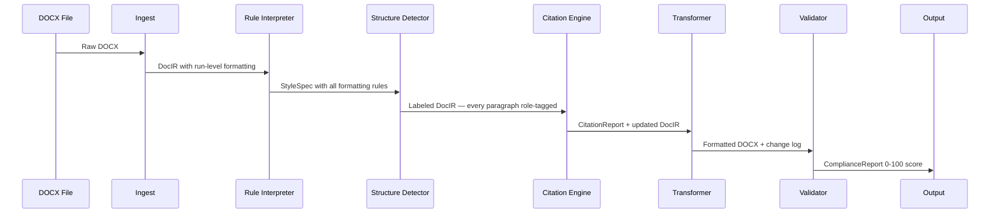
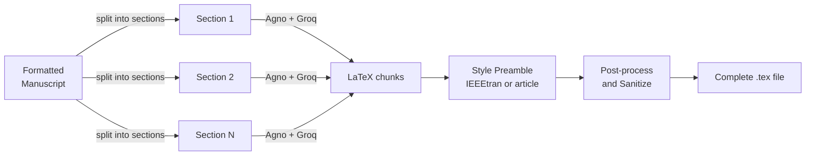
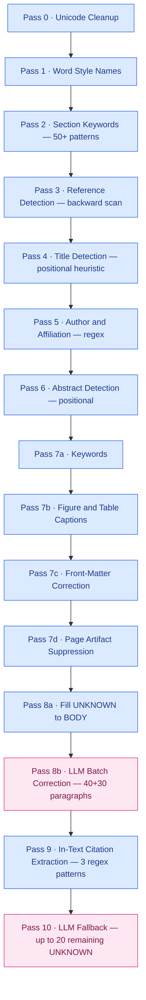
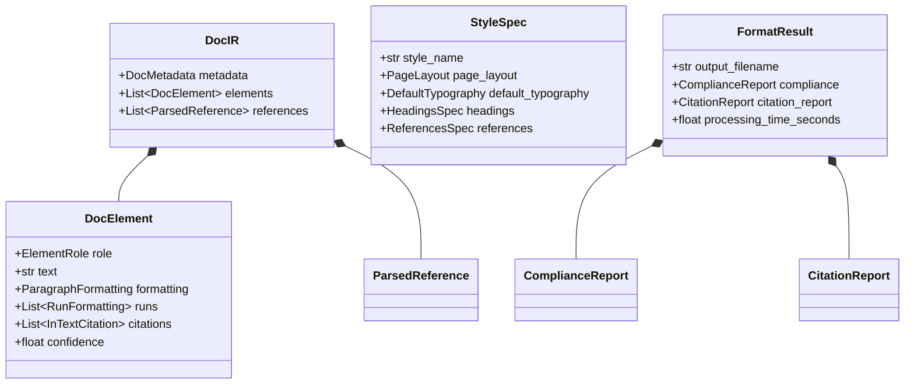
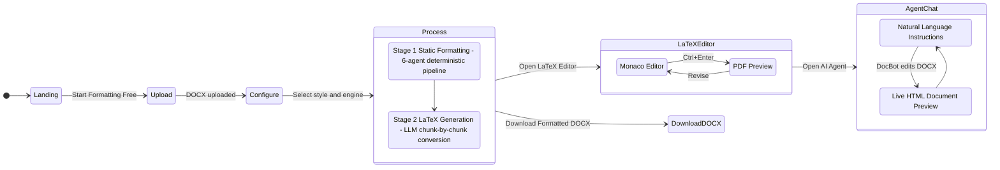

<div align="center">

# FormatForge AI

### Agentic Academic Manuscript Formatter

[](https://python.org)
[](https://fastapi.tiangolo.com)
[](https://react.dev)
[](https://groq.com)
[](LICENSE)

**Upload a research manuscript. Select a target style. Download publication-ready output.**

*HackaMineD 2026 · Cactus Communications / Paperpal Track*

[Full Technical Documentation](DOCUMENTATION.md)

</div>

---

## What It Does

FormatForge AI takes a raw DOCX manuscript and automatically transforms it to match any of five major academic publication styles — **APA 7, IEEE, Vancouver, MLA, or Chicago** — while simultaneously generating a complete, compilable **LaTeX source file**.

The system combines a **deterministic six-agent pipeline** for reliable DOCX formatting with an **LLM-powered LaTeX generation engine**, plus a conversational **MCP Document Editor Agent** for natural-language post‑processing.

---

## Architecture at a Glance



---

## Two-Stage Processing Pipeline

### Stage 1 — Deterministic DOCX Formatting



### Stage 2 — LLM LaTeX Generation



---

## The Six Agents

| # | Agent | Lines | LLM? | Responsibility |
|---|-------|------:|:-----:|----------------|
| 0 | **Orchestrator** | ~130 | — | Sequences the pipeline; assembles `FormatResult` |
| 1 | **Ingest** | 329 | no | Walks DOCX Open XML; builds `DocIR` with run-level formatting |
| 2 | **Rule Interpreter** | 359 | optional | Loads JSON `StyleSpec`; interprets custom guidelines via LLM |
| 3 | **Structure Detector** | 1,119 | yes | 10-pass hybrid heuristic + LLM paragraph role classifier |
| 4 | **Citation Engine** | 797 | no | Regex parse to citeproc-py format to fuzzy consistency check |
| 5 | **Transformer** | 1,382 | no | Applies every formatting rule; inserts labels; sets columns and headers |
| 6 | **Validator** | 626 | no | Opens output DOCX; scores 8 weighted compliance categories |

> Rule Interpreter only calls the LLM when custom guidelines are provided — hardcoded styles involve zero LLM calls.

---

## Structure Detector — 10-Pass Pipeline



---

## Data Schemas



---

## User Journey



---

## Five Academic Styles

| Feature | APA 7 | IEEE | Vancouver | MLA | Chicago |
|---------|:-----:|:----:|:---------:|:---:|:-------:|
| Font | TNR 12pt | TNR 10pt | TNR 12pt | TNR 12pt | TNR 12pt |
| Line Spacing | 2.0x | 1.0x | 2.0x | 2.0x | 2.0x |
| Columns | 1 | **2** | 1 | 1 | 1 |
| Citations | Author-date | Numeric `[N]` | Numeric `[N]` | Author-date | Author-date |
| Reference section | References | References | References | Works Cited | Bibliography |
| Running head | Yes 50 chars | No | No | No | No |
| Separate title page | Yes | No | No | No | Yes |
| Abstract max words | 250 | 200 | 300 | — | 300 |

---

## Compliance Validator

The Validator opens the actual output DOCX and scores eight weighted categories:

| Category | Weight | What Is Checked |
|----------|:------:|-----------------|
| `page_layout` | 15% | All four margins, page dimensions |
| `typography` | 15% | Font name, size, line spacing |
| `headings` | 15% | Bold, italic, alignment, case per level |
| `citations` | 15% | Citation-reference consistency score |
| `references` | 15% | Section label, hanging indent, entry spacing |
| `title_page` | 10% | Title presence, size, alignment, bold |
| `abstract` | 10% | Label presence, indent, font size |
| `tables_figures` | 5% | Caption presence and formatting |

Overall score = weighted average (0–100).

---

## MCP Document Editor Agent

After formatting, the **AI Agent** tab opens a 3-panel interface:

| Panel | Content |
|-------|---------|
| Left | Document file browser |
| Centre | Live HTML preview — auto-refreshes after every edit |
| Right | Chat window — **DocBot** powered by Agno + Groq |

DocBot has 25+ DOCX manipulation tools:

| Category | Tools |
|----------|-------|
| Reading | `read_document`, `read_paragraph`, `read_table`, `search_text`, `export_to_text` |
| Editing | `edit_paragraph_text`, `search_and_replace`, `delete_paragraph` |
| Adding | `add_paragraph`, `add_heading`, `add_table`, `add_bullet_list`, `add_numbered_list` |
| Formatting | `format_text`, `format_paragraph`, `set_paragraph_style`, `set_paragraph_alignment` |
| Management | `create_document`, `delete_document`, `duplicate_document` |

---

## Quick Start

```bash
# Clone
git clone https://github.com/vdt1905/Hack-NU-26.git
cd Hack-NU-26

# Python environment
python -m venv .venv
.venv\Scripts\activate          # Windows
# source .venv/bin/activate     # macOS / Linux

# Install dependencies
pip install -r requirements.txt

# Add your API key
echo GROQ_API_KEY=your_key_here > .env

# Launch everything (Windows)
start_all.bat

# OR start services individually
uvicorn backend.api:app --reload --port 8000   # API backend
cd frontend && npm install && npm run dev        # React frontend  http://localhost:5173
uvicorn mcp_editor.api:app --port 8082          # MCP editor agent
```

---

## Technology Stack

| Layer | Technologies |
|-------|-------------|
| Backend | Python 3.11, FastAPI, Pydantic v2, sse-starlette |
| Document I/O | python-docx, Open XML direct manipulation (lxml) |
| Citations | citeproc-py (CSL 1.0), thefuzz (Levenshtein distance) |
| LLM | Agno framework, Groq llama-3.3-70b, OpenAI fallback, Ollama local |
| MCP | FastMCP stdio transport, SqliteDb conversation persistence |
| Frontend | React 19, Vite, Tailwind CSS, Zustand state management |
| Code editor | Monaco Editor (@monaco-editor/react) |
| Animations | Framer Motion, GSAP, Three.js |
| LaTeX compile | latexonline.cc via browser-side form POST to iframe |

---

## Project Structure

```
Hack-NU-26/
├── backend/
│   ├── agents/               # orchestrator  ingest  rule_interpreter
│   │                         # structure_detector  citation_engine
│   │                         # transformer  validator  paragraph_merger
│   ├── llm/                  # LLM client wrapper + all prompt templates
│   ├── schemas/              # DocIR  StyleSpec  Reports  (Pydantic v2)
│   ├── styles/               # apa7  ieee  vancouver  mla  chicago  (JSON)
│   ├── api.py                # FastAPI v1 REST endpoints
│   └── agno_router.py        # v2 SSE streaming + LaTeX generation
├── frontend/
│   └── src/
│       ├── pages/            # Landing  Upload  Configure  Process  Latex  McpAgent
│       ├── components/       # 14 reusable UI components
│       └── store/            # useAppStore.js (Zustand)
├── mcp_editor/
│   ├── doc_editor_agent/     # DocBot Agno agent + 25+ DOCX tools
│   └── mcp_server/           # FastMCP stdio server
├── tests/                    # test_phase0 through test_phase4  test_mla_chicago
├── app.py                    # Streamlit legacy UI
├── DOCUMENTATION.md          # Full technical documentation (15 sections, 6 diagrams)
└── start_all.bat             # One-click launch (Windows)
```

---

## Full Technical Documentation

All agent internals, schema reference, API specification, LLM prompt templates, LaTeX preamble generation, style JSON structure, and extended Mermaid diagrams are in **[DOCUMENTATION.md](DOCUMENTATION.md)**.

---

<div align="center">

Built at **HackaMineD 2026** &nbsp;·&nbsp; Cactus Communications / Paperpal Track

</div>
